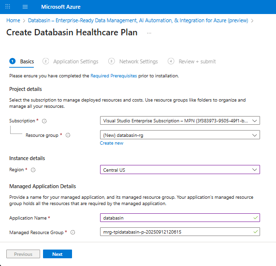
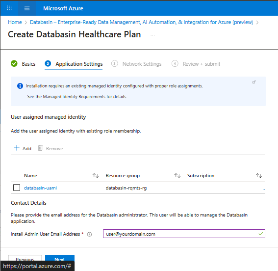

# Overview

This document provides a walkthrough of the installation wizard steps to
complete the installation of the managed Azure Marketplace offering:
**Databasin - Data Automation for Healthcare and AI**

Please ensure that all the
[prerequisites](https://github.com/tpidai/databasin/blob/main/docs/databasin_prerequisites_for_azure.md#resource-provider-requirements)
have been met before starting the installation wizard.

Access the Marketplace Offering

Databasin can be installed on Azure via two methods:

- **Public Offering**: Deployed via the Azure Marketplace.

- **Private Offering**: Installed via a private Azure Managed
  Application

If you have questions regarding which method of installation you will be
using, please contact support at:
[mailto:mclundeberg@technologypartners.net](mailto:mclundeberg@technologypartners.net)

### Public Offering

Use this [link](https://portal.azure.com/#create/technologypartnersinc1724763413158.tpidatabasintpidatabasin_0) to create the deployment in the Azure Portal to install the public Azure Marketplace Offering

### Private Offering

 - [Accept the private offer](https://learn.microsoft.com/en-us/marketplace/private-offers-accept-offer)
as outlined in the [prerequisites](https://github.com/tpidai/databasin/blob/main/docs/databasin_prerequisites_for_azure.md#private-offering-requirements)
 - [Purchase the private offer](https://learn.microsoft.com/en-us/marketplace/private-offers-purchase#purchase-the-private-offer) 

### Complete the Installation Wizard
**Basics** 

**Application Settings**

**Network Settings**

**Review + Submit**

- Double-check all configuration settings.

- Click **Deploy**.

- Wait for the installation to be completed (this may take several
  minutes).

