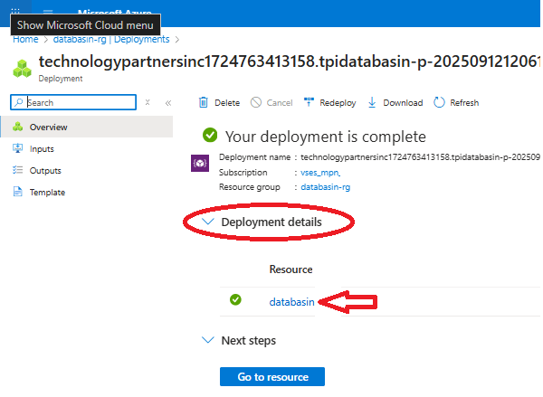

# Overview

This document provides a walkthrough of the installation wizard steps to
complete the installation of the managed Azure Marketplace offering:
**Databasin - Data Automation for Healthcare and AI**

Please ensure that all the
[prerequisites](https://github.com/tpidai/databasin/blob/main/docs/databasin_prerequisites_for_azure.md#resource-provider-requirements)
have been met before starting the installation wizard.

Access the Marketplace Offering

Databasin can be installed on Azure via two methods:

- **Public Offering**: Deployed via the Azure Marketplace.

- **Private Offering**: Installed via a private Azure Managed
  Application

If you have questions regarding which method of installation you will be
using, please contact support at:
[mailto:mclundeberg@technologypartners.net](mailto:mclundeberg@technologypartners.net)

### Public Offering

Use this [link](https://portal.azure.com/#create/technologypartnersinc1724763413158.tpidatabasintpidatabasin_0) to create the deployment in the Azure Portal to install the public Azure Marketplace Offering

### Private Offering

 - [Accept the private offer](https://learn.microsoft.com/en-us/marketplace/private-offers-accept-offer)
as outlined in the [prerequisites](https://github.com/tpidai/databasin/blob/main/docs/databasin_prerequisites_for_azure.md#private-offering-requirements)
 - [Purchase the private offer](https://learn.microsoft.com/en-us/marketplace/private-offers-purchase#purchase-the-private-offer) 

### Complete the Installation Wizard
#### Basics
##### Project Details
1. **Subscription**: Select the subscription
1. **Resource Group**: Create a new Resource Group (i.e. databasin-rg) 
##### Instance Details
1. **Region**: Select the region for deployed resources
##### Managed Application Details
1. **Application Name**: Name for the Application (i.e. Databasin)
1. **Managed Resource Group**: Must be unique to the subscription (leave default)

### Application Settings
### User assigned managed identity
1. Press the **+Add** to select the user assigned managed identity created as part of the [prerequisites](https://github.com/tpidai/databasin/blob/main/docs/databasin_prerequisites_for_azure.md#managed-identity-requirements)
### User assigned managed identity
1. **Install Admin User Email Address**: must be a valid email address

### Network Settings
#### Option 1: Use existing Virtual Network
1. **Deploy Gateway**: Recommend
1. **Virtual Network**: Select existing virtual network with existing subnets and delegations configured as part of the [prerequisites](https://github.com/tpidai/databasin/blob/main/docs/databasin_prerequisites_for_azure.md#network-requirements)
1. **Databasin Subnet**: Select previously configured size /25 or larger subnet with Microsoft.App/environments delegation
1. **Databasin Management Subnet**: Select previously configured size /29 or larger subnet
1. **PostgreSQL Subnet**: Select previously configured size /28 or larger subnet with Microsoft.DBforPostgreSQL/flexibleServers delegation

#### Option 1: Create new Virtual Network
You may leave the new virtual network settings defaulted or select **edit** to modify the virtual network settings.
1. **Deploy Gateway**: Recommend
1. **Virtual Network**: Must be of of size /24 or larger
1. **Databasin Subnet**: Must be size /25 or larger
1. **Databasin Management Subnet**: Must be size /29 or larger
1. **PostgreSQL Subnet**: Must be size /28 or larger

### Review + Submit
#### Terms
1. Review the terms
1. **Prefered Phone Number**: Provide a valid phone number
#### Co-Admin Access Permission
1. **I agree to the terms and conditions above**: checked

### Details

1. Review all configuration settings
2. Click **Create **. 

### Deployment
1. Wait for the installation to complete (this will take several
  minutes).

