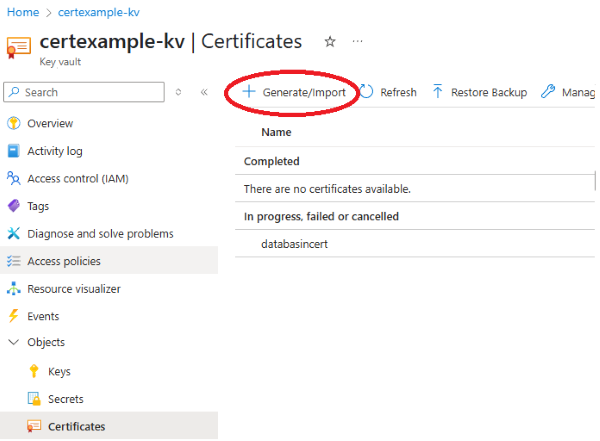
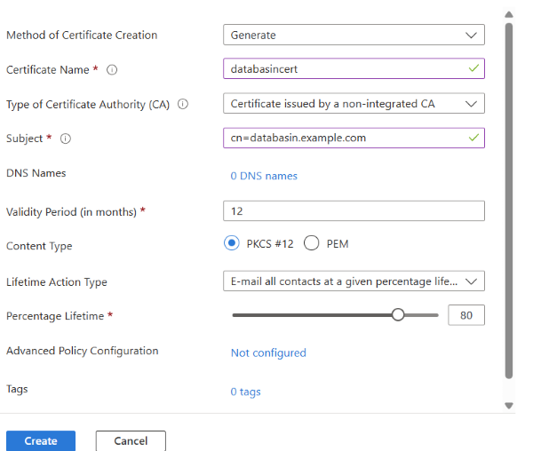
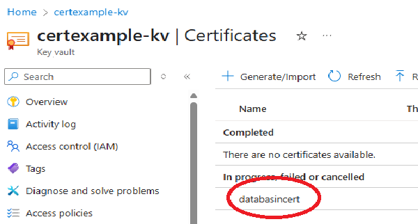
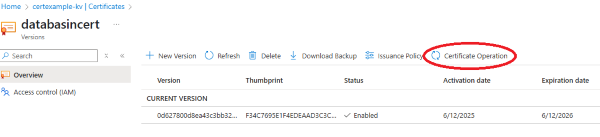
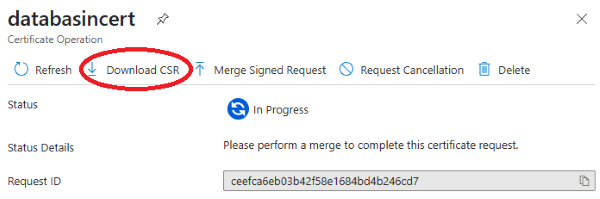
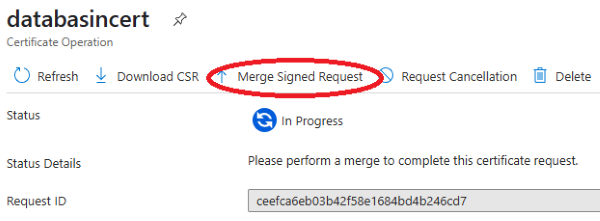

# Overview

This guide details the steps required to configure an SSL certificate from a non-partnered CA provider using an Azure Key Vault certificates

# Prerequisites

- An **Azure Key Vault** to manage certificates

- Permission
    - **Key Vault Certificates Officer**
    - **Key Vault Secrets User**

# Azure Key Vault Creation

Here\'s a step-by-step guide:

1.  Navigate to the Azure portal: https://portal.azure.com.
1.  Search for Key Vault: In the search bar, type \"***Key Vault***\" and select it from the results. 
1.  Create a new Key Vault: Click on the \"***Create***\" button. 
1.  Provide basic information:
    - **Subscription:** Select your Azure subscription. 
    - **Resource group:** Choose an existing resource group or create a
      new one
    - **Name:** Enter a globally unique name for your Key Vault
    - **Region:** Select the Azure region where you want to deploy the
      vault. 
    - **Pricing Tier:** Select the pricing tier ***-\> Standard***
    - **Recovery options:** Accept Defaults
1.  Review and Create:
    - Click on \"***Review + create***\". 
    - Verify the configuration and then click \"**Create**\". 

# Certificate Generation Walk through

  Ensure you have following Role assignments on the Azure Key Vault to complete this walk through
  - **Key Vault Certificates Officer**
  - **Key Vault Secrets User**

Generate the Certificate

1.  Navigate to the Azure portal: https://portal.azure.com.

2.  Search for Key Vault: In the search bar, type \"***Key Vault***\" and select it from the results. 

3.  Navigate to the **Certificates** blade of the **Azure Key Vault** and select **Generate/Import\**
    
    

4.  Create the Certificate

    

5.  **Navigate to the certificate**

    

6.  **Select Certificate Operations**
    
    

7.  Download the CSR file
    
    

8.  Submit the CSR file to your CA provider

9.  After the request is signed, select **Merge Signed Request** on the **Certificate Operation** tab to add the signed certificate to Key Vault.
    
    
