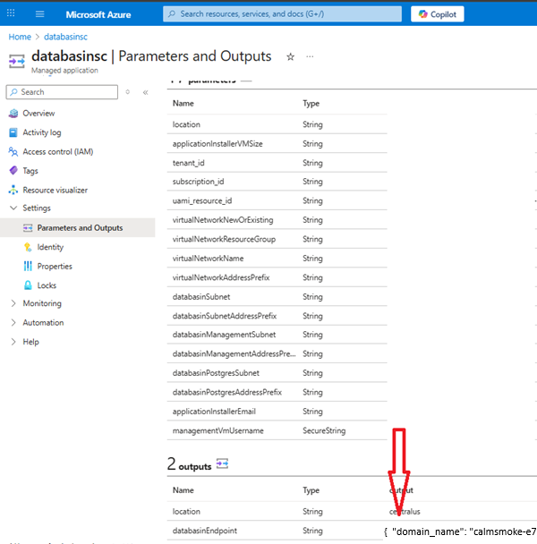
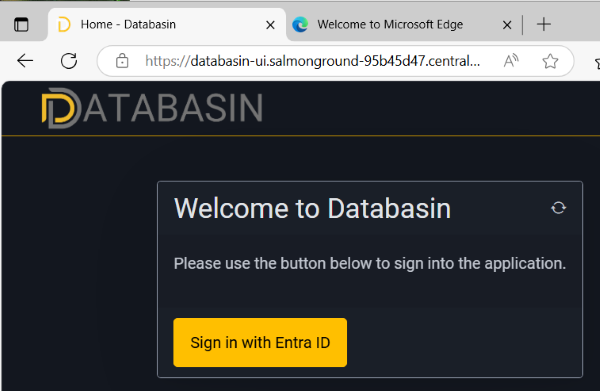
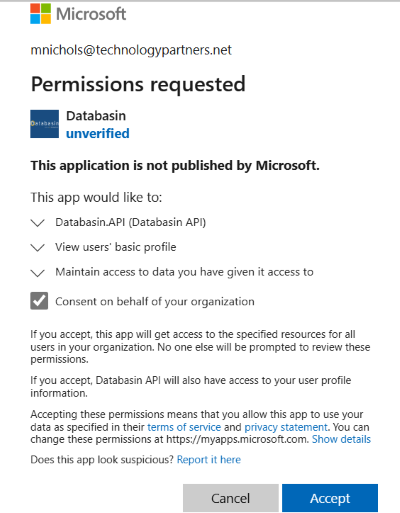
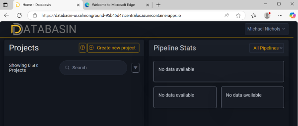

# Overview

This guide details the configuration steps that need to be completed after installing the managed Azure Marketplace offering: **Databasin -Data Automation for Healthcare and AI**

## Prerequisites
You must have the information below obtained from the "databasinEndpoint" output value from your Databasin Deployment. If you already have these values, skip to the [DNS Configuration](#dns-configuration) section of this document.
1. ***domain_name***: Dynamically created domain name for the Databasin environment (i.e. calmsmoke-e7a7bdc1.centralus.azurecontainerapps.io )
1. ***domain_ip_address***: The static IP address associated to the Databasin environment in Azure (i.e. 172.16.0.112 )
1. ***databasin_login_url***: The URL to login to Databasin (i.e. https://databasin-ui.calmsmoke-e7a7bdc1.centralus.azurecontainerapps.io)

## Retrive Deployment Output values
1. Navigate to the Databasin Managed Application overview page in the Azure Portal by searching for and selecting the Databasin application instance.
1. From the menu on the left of the Managed Application **Overview** blade, select the **Settings** -> **Parameters and Outputs**  and scroll to the **outputs** section to copy the value of the **databasinEndpoint** output.
   
   
  
   Example Output:
   ``` 
   {  "domain_name": "calmsmoke-e7a7bdc1.centralus.azurecontainerapps.io",  "domain_ip_address": "172.16.0.112",  "databasin_login_url": "https://databasin-ui.calmsmoke-e7a7bdc1.centralus.azurecontainerapps.io"  }
   ```
   You will use these values in the following steps


## DNS Configuration
Configure your internal environment DNS infrastructure to route traffic to Databasin by creating a DNS zone and Host A records to resolve to the Databasin application in Azure


### DNS Zone Creation
Create a DNS Zone using the **domain_name** value (i.e. calmsmoke-e7a7bdc1.centralus.azurecontainerapps.io )
### DNS Records Creation
Select you DNS Zone (i.e. calmsmoke-e7a7bdc1.centralus.azurecontainerapps.io ) to add the following record sets:
- Root:
    - Name: "@"
    - Value: enter the value of **domain_ip_address** (i.e. 172.16.0.112 )
    - TTL: 3600
- Wildcard:
    - Name: "*"
    - Value: enter the value of **domain_ip_address** (i.e. 172.16.0.112 )
    - TTL: 3600


## Databasin Permissions Consent

1. Open Microsoft Edge/Chrome browser and navigate to the **databasin_login_url** and you should see the **Databasin** login page.
    
    

2.  Sign-in with the **Installer Email Address** previously supplied and **Consent on behalf of your organization** to approve the required **Databasin** permissions

    

## Configuring VNet Peering & DNS

1.  Set-up **VNet Peering** to enable communication across different VNets.

##  Complete Project Configuration




## Troubleshooting & Support

- If encountering **connectivity issues**:

- Check **VNet and firewall settings**.

- Logs can be reviewed in **Azure Monitor** and **Container App Logs**.

- If further assistance is needed, contact **Databasin Support**.
