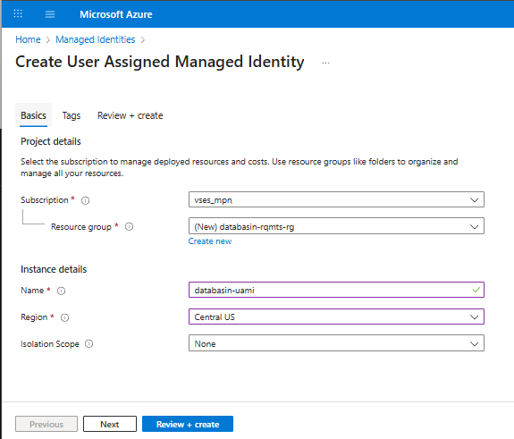
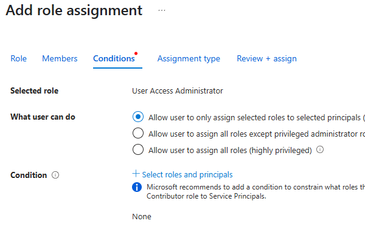

# Overview

This guide details the prerequisites that need to be completed prior to
installing the managed Azure Marketplace offering: **Databasin - Data
Automation for Healthcare and AI**

Databasin can be installed on Azure via two methods:

- **Public Offering**: Deployed via the Azure Marketplace.

- **Private Offering**: Installed via a private Azure Managed
  Application

If you have questions regarding which method of installation you will be
using, please contact support at:
[mailto:mclundeberg@technologypartners.net](mailto:mclundeberg@technologypartners.net)

# Prerequisites 

Before installation, ensure you have completed the following
requirements:

## Resource Provider Requirements

The following **resource providers** must be registered within the Azure
subscription for installation of the Databasin Offering:

|  |  |
| --- | --- |
| Microsoft.App | Microsoft.Network |
| Microsoft.AppConfiguration| Microsoft.OperationalInsights |
| Microsoft.Compute | Microsoft.Storage |
| Microsoft.DBforPostgreSQL | Microsoft.Web |
| Microsoft.KeyVault |  |

Following [these directions](https://learn.microsoft.com/en-us/azure/azure-resource-manager/management/resource-providers-and-types#register-resource-provider-1) to ensure all required **resource providers** are registered.

## Subscription Usage + quotas

Ensure you have sufficient quota available to deploy a **Standard_D4ds_v5** virtual machine in the Azure Subscription

1.  **Login to the Azure portal:** Access the Azure portal using your Microsoft account credentials. 
1.  **Navigate to your subscription:** Locate the subscription you want to examine and click on it. 
1.  **Access \"Usage + quotas\":** In the left-hand navigation pane, under \"Settings,\" select \"Usage + quotas\". 
1.  **Filter by provider or region:** You can use the filters at the top of the page to narrow down the display to compute resource by region. 
1.  **View Standard DDSv5 Family vCPUs:** Type "**Standard DDSv5 Family vCPUs"** in the search box to view your current usage**\**

    

1.  **Request quota increases:** If you need to increase a quota, you can initiate a request by selecting the **Request Adjust** icon.

## Network Requirements
### Network Setup

#### Virtual Network

##### Option 1: Create a new **Virtual Network** during the installation

You must have an available address space of size of /24 available to use
during the installation. No other Networking requirements must be met
prior to installation.

##### Option 2: Use an existing or preconfigured Virtual Network

The following network subnets and subnet delegations are required (subnet names are only suggestions). This must be configured prior to installation if using an existing Virtual Network or you desire to configuration the Virtual Network and subnet in advance.

**Ensure there are no Network Security Groups or NAT Gateways associated with these subnet as they will be created during installation.**

| **Subnet Name**| **Min Size** | **Delegation** | **Service** |
| --- | --- | --- | --- |
| databasin-sn            | /25                 | Microsoft.App/environments                | Microsoft.KeyVault      |
|                         |                     |                                           | Microsoft.Sql           |
|                         |                     |                                           | Microsoft.Storage       |
| databasin-postgresql-sn | /28                 | Microsoft.DBforPostgreSQL/flexibleServers | Microsoft.Storage       |
| databasin-management-sn | /29                 |                                           | Microsoft.Storage       |
|                         |                     |                                           | Microsoft.KeyVault      |     |

## Managed Identity Requirements

Follow [these directions](https://learn.microsoft.com/en-us/entra/identity/managed-identities-azure-resources/how-manage-user-assigned-managed-identities?pivots=identity-mi-methods-azp#create-a-user-assigned-managed-identity) to create the required user-assignment managed identity and then assign the Microsoft Entra ID role and Azure Subscription roles

### Managed Identity Role Assignments

The user-assigned managed identity must have the following Microsoft Entra ID and Azure Subscription role assignments:

#### Microsoft Entra ID Roles

- **Cloud Application Administrator** role. This role assignment can be removed after installation/configuration by first assigning the managed identity as an owner of the **Databasin** and **Databasin API** App Registrations created during installation.
  - Settings:
    - **Assignment Type**: Active
    - **Permanently Assigned**: Checked

  

#### Azure Subscription Roles

- **Contributor** role granted at the subscription level. 
  - Assignment type
    - **Assignment Type**: Active
    - **Assignment Duration**: **Permanent**
  
  

- **User Access Administrator** role granted at the subscription level. 
  - Conditions:
    - **What user can do**: Allow user to assign all roles (highly privileged)
    - **Conditions**: None

  

  - Assignment type
    - **Assignment Type** is **Active**
    - **Assignment duration** is **Permanent** and no conditions as assigned
    
  

## Private Offering Requirements

The following requirements are only required if installation is via an
Azure Marketplace Private offering.

- [Prepare your
  account](https://learn.microsoft.com/en-us/marketplace/private-offers-pre-check)

- [Ensure user role assignments are
  completed](https://learn.microsoft.com/en-us/marketplace/private-offers-pre-check#check-user-role-assignments)

- [Locate your billing
  account](https://learn.microsoft.com/en-us/marketplace/private-offers-pre-check#locate-your-billing-account-id)
  and provide TPI with the **Billing Account Id**

- [Accept the private
  offer](https://learn.microsoft.com/en-us/marketplace/private-offers-accept-offer)
